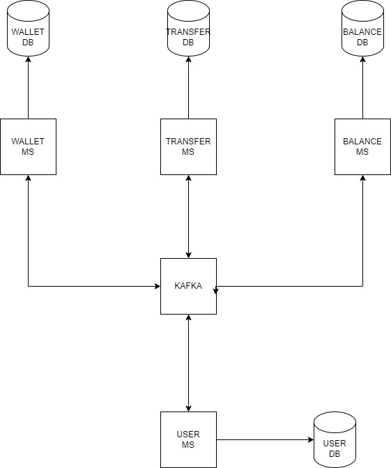

# Wallet-ms

## Overview

The Wallet-ms is a reactive web application designed to manage digital wallets. Users can create wallets, perform transfers, and manage their balances efficiently. The service leverages a microservices architecture to ensure scalability and maintainability.

## Technology Stack

- **Java**
- **Spring Boot**
- **Spring WebFlux**: For building reactive web applications using non-blocking I/O.
- **PostgreSQL**
- **R2DBC**: Reactive programming support for SQL databases in a non-blocking way.
- **Docker**
- **JUnit**
- **Mockito**

## Getting Started

To run the project locally, follow these steps:

### Prerequisites

- Docker installed on your machine.
- Java 21.
- Any database managment tool like DBeaver.


### Clone the Repository

```bash
git clone git@github.com:hymuura/recargapay-challenge.git
```

### Run the following docker command
```bash
sudo docker run --name postgres-testdb -e POSTGRES_USER=user -e POSTGRES_PASSWORD=pass -e POSTGRES_DB=testdb -p 5432:5432 -d postgres
```
### Access the database and execute the script located in the resources folder of the project.

### Build the Project
```bash
mvn clean install
```

### Run the project


## API Endpoints
### Create a wallet
```
curl --location 'http://localhost:8080/wallet' \
--header 'Content-Type: application/json' \
--data '{
"userName":"userName",
"currency":"USD"
}'
```
### Make a transfer
```
curl --location 'http://localhost:8080/transfer' \
--header 'Content-Type: application/json' \
--data '{
"walletSourceId":1,
"walletTargetId":3,
"amount":"1000",
"currency":"USD"
}'
```


## Trade-offs
due to time constraints, I spent the challenge time for the following:
- **Analyzing** the problem
- **Designing** the solution
- **Creating** the project from the scratch
- **Implementing** Spring WebFlux
- **Developing** the wallet and transfer endpoint in **the same project**

due to time constraints, the following functionalities couldn't be completed:

- Balance endpoint
- Deposit endpoint
- Withdraw endpoint

## Expected solution


### Components:
- Wallet DB: A database that stores information about user wallets, including their unique identifiers, balances, and other relevant details.
- Transfer DB: A database that records information about transfer transactions, such as the sender's and recipient's wallet IDs, the transfer amount, and the timestamp.
- Balance DB: A database that stores the current balances of all user wallets.
- Wallet MS: A microservice responsible for managing wallet information, including creating new wallets, updating wallet details, and querying wallet balances.
- Transfer MS: A microservice responsible for handling transfer transactions, including validating the transfer request, updating wallet balances, and recording the transaction in the Transfer DB.
- Balance MS: A microservice responsible for maintaining and updating user balances.
- Kafka: A distributed streaming platform used for real-time data processing and communication between the microservices.

### Benefits:
- Scalability: The system can be scaled horizontally by adding more instances of each microservice to handle increased load.
- Resilience: The use of Kafka ensures that messages are persisted to disk, making the system more resilient to failures.
- Flexibility: The modular design of the microservices allows for easy changes and updates to the system without affecting other components.
- Real-time processing: Kafka enables real-time processing of data, allowing for immediate updates of balances and other information.
